# 画面遷移図

## 画面一覧

| No | 画面名 | 機能カテゴリ | 管理者 | メンバー |
|----|--------|------------|:------:|:--------:|
| 01 | ログイン画面 | 認証 | ○ | ○ |
| 02 | 新規ユーザー登録画面 | 認証 | ○ | ○ |
| 03 | パスワードリセット画面 | 認証 | ○ | ○ |
| 04 | トップページ | トップ | ○ | ○ |
| 05 | コミュニティ作成画面 | トップ | ○ | - |
| 06 | コミュニティ選択画面 | トップ | ○ | ○ |
| **ホーム** |
| 07 | ホーム画面 | ホーム | ○ | ○ |
| 08 | コミュニティ詳細画面 | ホーム | ○ | ○ |
| 09 | 新着通知一覧画面 | ホーム | ○ | ○ |
| 10 | カレンダー画面 | ホーム | ○ | ○ |
| **メンバー** |
| 11 | メンバー一覧画面 | メンバー | ○ | ○ |
| 12 | メンバー詳細画面 | メンバー | ○ | ○ |
| 13 | メンバー管理画面 | メンバー | ○ | - |
| 14 | 会員ステータス変更画面 | メンバー | ○ | - |
| **メール配信** |
| 15 | メール配信一覧画面 | メール配信 | ○ | - |
| 16 | メール作成画面 | メール配信 | ○ | - |
| 17 | 配信履歴画面 | メール配信 | ○ | - |
| **掲示板** |
| 18 | 掲示板一覧画面 | 掲示板 | ○ | ○ |
| 19 | 投稿詳細画面 | 掲示板 | ○ | ○ |
| 20 | 投稿作成画面 | 掲示板 | ○ | △ |
| **設定** |
| 21 | コミュニティ設定画面 | 設定 | ○ | - |
| 22 | 権限設定画面 | 設定 | ○ | - |
| 23 | サイトデザイン設定画面 | 設定 | ○ | - |
| **プロジェクト** |
| 24 | プロジェクト一覧画面 | プロジェクト | ○ | ○ |
| 25 | プロジェクト詳細画面 | プロジェクト | ○ | ○ |
| 26 | プロジェクト登録画面 | プロジェクト | ○ | △ |
| 27 | プロジェクト掲示板画面 | プロジェクト | ○ | ○ |
| **イベント** |
| 28 | イベント一覧画面 | イベント | ○ | ○ |
| 29 | イベント詳細画面 | イベント | ○ | ○ |
| 30 | イベント登録画面 | イベント | ○ | △ |
| 31 | イベントカレンダー画面 | イベント | ○ | ○ |
| 32 | 参加者一覧画面 | イベント | ○ | - |
| **動画** |
| 33 | 動画一覧画面 | 動画 | ○ | ○ |
| 34 | 動画視聴画面 | 動画 | ○ | ○ |
| 35 | 動画登録画面 | 動画 | ○ | - |
| 36 | 動画カテゴリ管理画面 | 動画 | ○ | - |
| **アナリティクス** |
| 37 | アナリティクスダッシュボード画面 | アナリティクス | ○ | - |
| 38 | メンバー活動分析画面 | アナリティクス | ○ | - |
| 39 | イベント参加分析画面 | アナリティクス | ○ | - |
| **ポイント** |
| 40 | ポイント一覧画面 | ポイント | ○ | ○ |
| 41 | ポイント発行画面 | ポイント | ○ | - |
| 42 | ポイント履歴画面 | ポイント | ○ | ○ |
| **アンケート** |
| 43 | アンケート一覧画面 | アンケート | ○ | ○ |
| 44 | アンケート回答画面 | アンケート | ○ | ○ |
| 45 | アンケート登録画面 | アンケート | ○ | - |
| 46 | アンケート結果画面 | アンケート | ○ | - |
| **スキルシェア** |
| 47 | スキルシェア一覧画面 | スキルシェア | ○ | ○ |
| 48 | スキルシェア詳細画面 | スキルシェア | ○ | ○ |
| 49 | スキルシェア登録画面 | スキルシェア | ○ | ○ |
| 50 | コメント画面 | スキルシェア | ○ | ○ |
| **ショップ（EC）** |
| 51 | ショップ一覧画面 | ショップ | ○ | ○ |
| 52 | 商品詳細画面 | ショップ | ○ | ○ |
| 53 | 商品登録画面 | ショップ | ○ | △ |
| **その他** |
| 54 | チャット画面 | メッセージ | ○ | ○ |
| 55 | 決済画面 | 決済 | ○ | ○ |

※ ○: 利用可能 / △: 権限設定により制限可能 / -: 利用不可

---

## 1. 認証フロー

```
トップページ ─────┬─────→ ログイン画面 ─────→ コミュニティ選択画面
                  │            │
                  │            └─────→ パスワードリセット画面 ─────→ ログイン画面
                  │
                  └─────→ 新規登録画面 ─────→ コミュニティ選択画面
```

---

## 2. コミュニティ作成・選択フロー

```
コミュニティ選択画面 ─────┬─────→ 既存コミュニティ選択 ─────→ コミュニティ画面（ホーム）
                         │
                         └─────→ コミュニティ作成画面 ─────→ コミュニティ画面（ホーム）
                                    【管理者のみ】
```

---

## 3. 全体画面遷移図

```plantuml
@startuml 全体画面遷移図
skinparam backgroundColor #FFFFFF
skinparam defaultFontSize 11
skinparam roundcorner 10

skinparam state {
    BackgroundColor #E3F2FD
    BorderColor #1976D2
}

title 全体画面遷移図

state "トップページ" as TOP

state "認証" as AUTH {
    state "ログイン画面" as LOGIN
    state "新規登録画面" as REGISTER
    state "パスワードリセット" as PW_RESET
}

state "コミュニティ選択" as COM_SELECT
state "コミュニティ作成" as COM_CREATE

TOP --> LOGIN
TOP --> REGISTER
TOP --> COM_SELECT
LOGIN --> PW_RESET
PW_RESET --> LOGIN
LOGIN --> COM_SELECT
REGISTER --> COM_SELECT
COM_SELECT --> COM_CREATE
COM_CREATE --> COMMUNITY

state "コミュニティ画面" as COMMUNITY {

    state "ホーム" as HOME {
        state "ホーム画面" as H
        state "コミュニティ詳細" as H1
        state "新着通知一覧" as H2
        state "カレンダー" as H3

        H --> H1
        H --> H2
        H --> H3
    }

    state "メンバー" as MEMBER {
        state "メンバー一覧" as M
        state "メンバー詳細" as M1
        state "チャット" as M2
        state "メンバー管理" as M3
        state "ステータス変更" as M4

        M --> M1
        M1 --> M2
        M --> M3
        M3 --> M4
    }

    state "メール配信" as MAIL {
        state "配信一覧" as ML
        state "メール作成" as ML1
        state "配信履歴" as ML2

        ML --> ML1
        ML --> ML2
    }

    state "掲示板" as BOARD {
        state "掲示板一覧" as B
        state "投稿詳細" as B1
        state "コメント" as B2
        state "投稿作成" as B3

        B --> B1
        B1 --> B2
        B --> B3
    }

    state "設定" as SETTING {
        state "設定画面" as S
        state "コミュニティ設定" as S1
        state "権限設定" as S2
        state "デザイン設定" as S3

        S --> S1
        S --> S2
        S --> S3
    }

    state "プロジェクト" as PROJECT {
        state "プロジェクト一覧" as P
        state "プロジェクト詳細" as P1
        state "プロジェクト掲示板" as P2
        state "プロジェクト登録" as P3

        P --> P1
        P1 --> P2
        P --> P3
    }

    state "イベント" as EVENT {
        state "イベント一覧" as E
        state "イベント詳細" as E1
        state "参加者一覧" as E2
        state "決済画面" as E3
        state "イベント登録" as E4
        state "イベントカレンダー" as E5

        E --> E1
        E1 --> E2
        E1 --> E3
        E --> E4
        E --> E5
        E5 --> E1
    }

    state "動画" as VIDEO {
        state "動画一覧" as V
        state "動画視聴" as V1
        state "動画登録" as V2
        state "カテゴリ管理" as V3

        V --> V1
        V --> V2
        V --> V3
    }

    state "アナリティクス" as ANALYTICS {
        state "ダッシュボード" as A
        state "メンバー活動分析" as A1
        state "イベント参加分析" as A2

        A --> A1
        A --> A2
    }

    state "ポイント" as POINT {
        state "ポイント一覧" as PT
        state "ポイント履歴" as PT1
        state "ポイント発行" as PT2

        PT --> PT1
        PT --> PT2
    }

    state "アンケート" as SURVEY {
        state "アンケート一覧" as Q
        state "アンケート回答" as Q1
        state "アンケート登録" as Q2
        state "アンケート結果" as Q3

        Q --> Q1
        Q --> Q2
        Q --> Q3
    }

    state "スキルシェア" as SKILL {
        state "スキルシェア一覧" as SK
        state "スキルシェア詳細" as SK1
        state "コメント画面" as SK2
        state "スキルシェア登録" as SK3

        SK --> SK1
        SK1 --> SK2
        SK --> SK3
    }

    state "ショップ" as SHOP {
        state "ショップ一覧" as SH
        state "商品詳細" as SH1
        state "商品登録" as SH2

        SH --> SH1
        SH --> SH2
    }
}

COM_SELECT --> COMMUNITY

' コミュニティ画面内のナビゲーション（サイドメニューから各機能へ）
COMMUNITY --> HOME
COMMUNITY --> MEMBER
COMMUNITY --> MAIL
COMMUNITY --> BOARD
COMMUNITY --> SETTING
COMMUNITY --> PROJECT
COMMUNITY --> EVENT
COMMUNITY --> VIDEO
COMMUNITY --> ANALYTICS
COMMUNITY --> POINT
COMMUNITY --> SURVEY
COMMUNITY --> SKILL
COMMUNITY --> SHOP

@enduml
```



---

## 4. 権限による機能制限まとめ

| 機能 | 管理者 | メンバー | 備考 |
|------|:------:|:--------:|------|
| **ホーム** | ○ | ○ | 詳細・通知・カレンダー閲覧 |
| **メンバー一覧/詳細** | ○ | ○ | 閲覧のみ |
| **メンバー管理** | ○ | - | ステータス変更・強制退会 |
| **メール配信** | ○ | - | 配信作成・履歴閲覧 |
| **掲示板閲覧** | ○ | ○ | 閲覧制限に従う |
| **掲示板投稿** | ○ | △ | 投稿制限設定による |
| **設定** | ○ | - | コミュニティ・権限・デザイン |
| **プロジェクト閲覧** | ○ | ○ | 参加・詳細閲覧 |
| **プロジェクト登録** | ○ | △ | 権限設定による |
| **イベント閲覧** | ○ | ○ | 一覧・詳細・カレンダー |
| **イベント登録** | ○ | △ | 権限設定による |
| **参加者管理** | ○ | - | 出欠・参加費管理 |
| **動画閲覧** | ○ | ○ | 閲覧制限に従う |
| **動画登録** | ○ | - | アップロード・カテゴリ管理 |
| **アナリティクス** | ○ | - | 全分析機能 |
| **ポイント閲覧** | ○ | ○ | 保有・履歴確認 |
| **ポイント発行** | ○ | - | 発行・期限設定 |
| **アンケート回答** | ○ | ○ | 一覧・回答 |
| **アンケート登録/結果** | ○ | - | 作成・集計閲覧 |
| **スキルシェア** | ○ | ○ | 登録・依頼・コメント |
| **ショップ閲覧** | ○ | ○ | 一覧・詳細 |
| **ショップ出品** | ○ | △ | 権限設定による |

※ ○: 利用可能 / △: 権限設定により制限可能 / -: 利用不可
